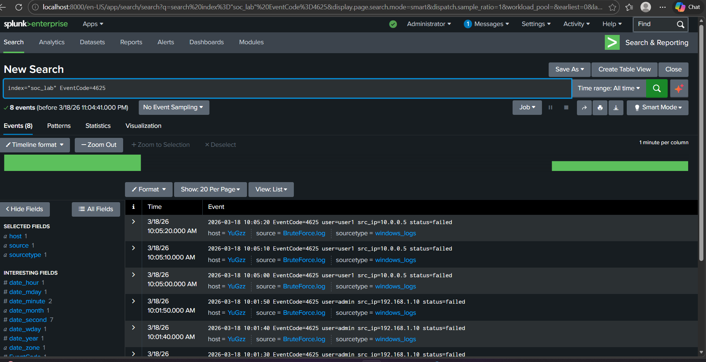
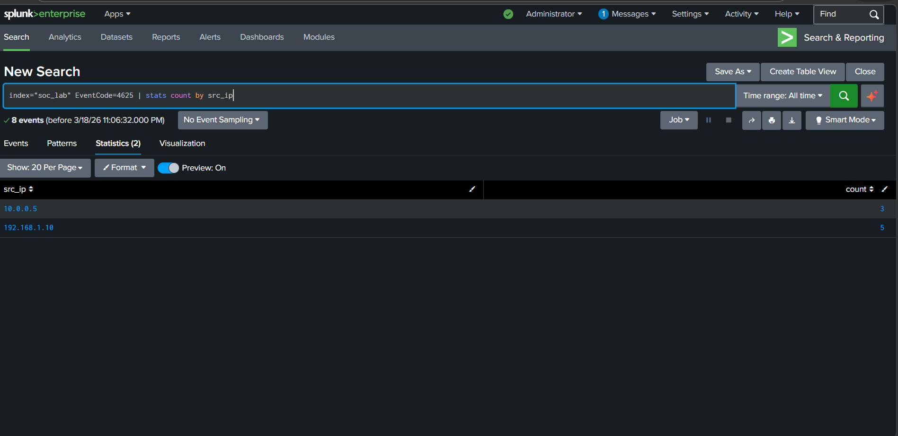
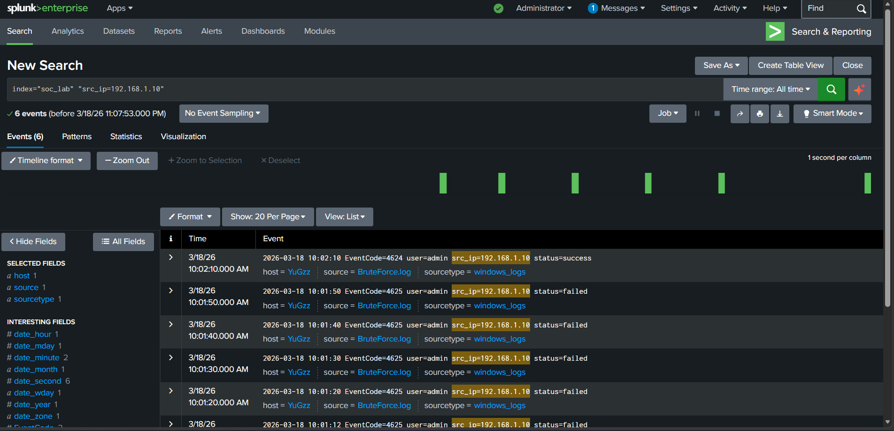
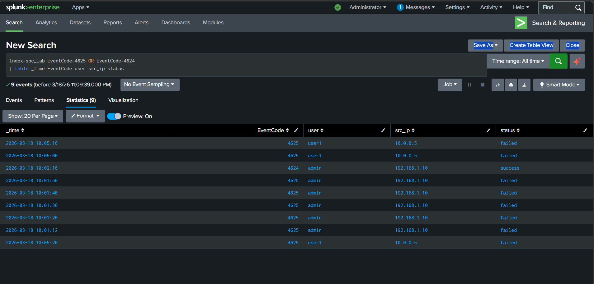

# Windows Brute Force Attack Investigation

## Incident Summary

Multiple failed login attempts were detected from a single IP address targeting the Administrator account. The activity resulted in a successful login after several failures, indicating a successful brute force attack.

---

## Investigation Evidence

### Failed Login Attempts

Multiple EventCode 4625 entries indicate repeated failed login attempts.

---

### Attacker IP Identification

The IP address 192.168.1.10 generated the highest number of failed login attempts.

---

### Successful Compromise Evidence

A successful login (EventCode 4624) occurred after multiple failed attempts from the same IP.

---

### Attack Timeline

The timeline shows repeated failures followed by a successful login, confirming attack progression.

---

## Key Findings

- Repeated failed login attempts from a single IP
- High frequency indicates brute force attack
- Successful login confirms account compromise

---

## MITRE ATT&CK Mapping

Technique: T1110 — Brute Force

---

## Severity

Critical

---

## Detection Logic

Trigger alert if:

- More than 5 failed login attempts (EventCode 4625)
- From same IP within short timeframe

AND

- Followed by successful login (EventCode 4624)

---

## Recommended Response

- Block the attacking IP
- Reset compromised account password
- Enable Multi-Factor Authentication (MFA)
- Monitor for further suspicious activity

---

## What I Learned

- How to detect brute force attacks using log analysis
- Importance of EventCode 4625 and 4624
- How to correlate events to identify attack success
- How to create detection logic in SIEM systems
