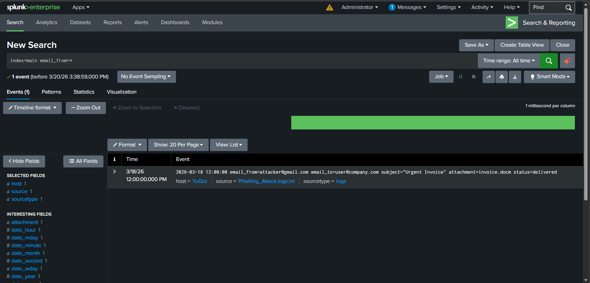
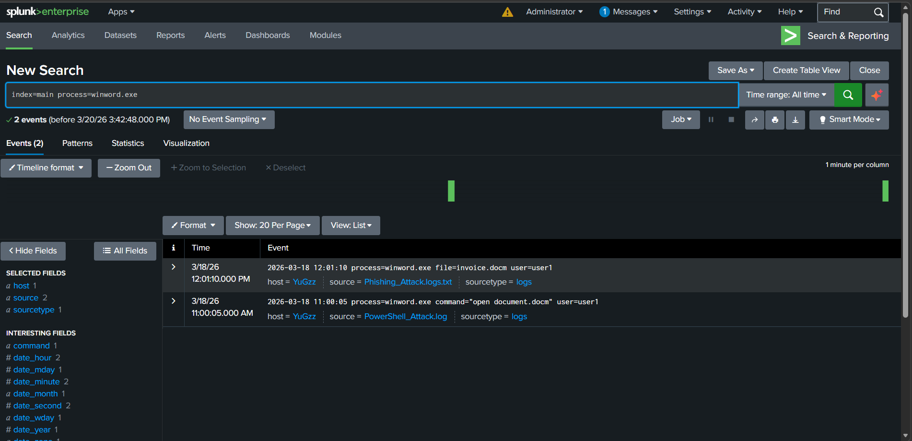
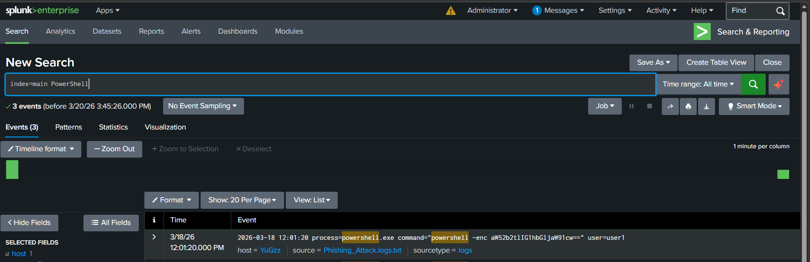
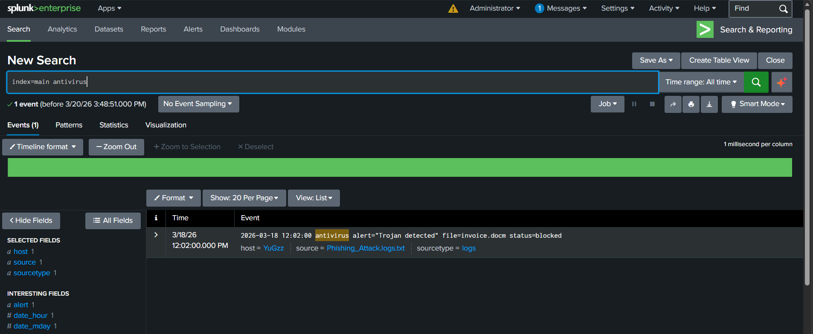

# Phishing Email Malware Investigation

## Incident Summary

A phishing email containing a malicious attachment was delivered to the user. The attachment was executed, leading to PowerShell-based malware activity and external network communication.

---

## Investigation Evidence

### Phishing Email

### Attachment Execution

### Malware Execution

### External Network Connection

### Antivirus Detection

---

## Key Findings

- Suspicious email with macro-enabled attachment (.docm)
- User executed attachment using Word
- PowerShell executed with encoded command
- External connection to suspicious IP
- Antivirus detected Trojan

---

## MITRE ATT&CK Mapping

- T1566 — Phishing  
- T1059 — Command and Scripting Interpreter  

---

## Severity

Critical

---

## Detection Logic

Trigger alert if:

- Email contains macro-enabled attachment
- Attachment execution followed by PowerShell activity
- External network connection after execution

---

## Recommended Response

- Block sender email
- Quarantine affected system
- Disable macros
- Monitor network traffic

---

## What I Learned

- How phishing attacks deliver malware
- Importance of correlating multiple logs
- Understanding full attack chain
