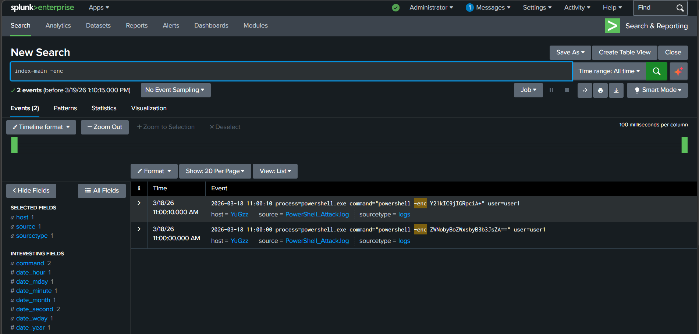
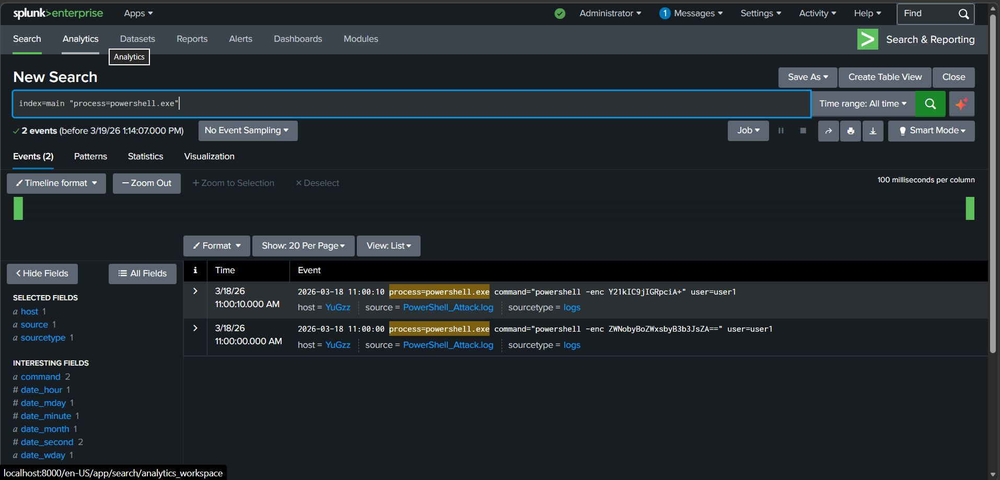
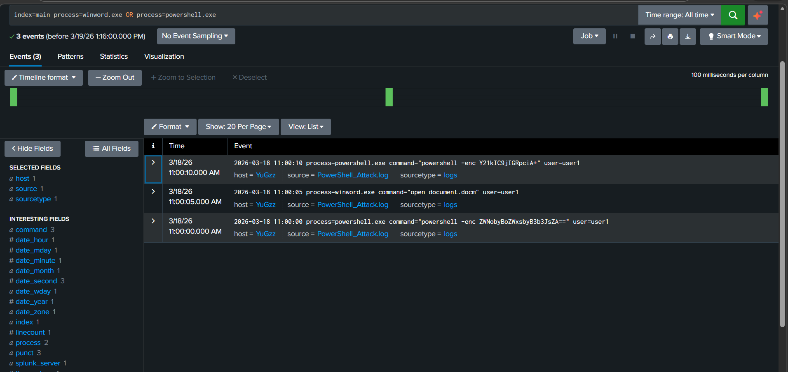

# Suspicious PowerShell Execution Investigation

## Incident Summary

Suspicious PowerShell execution with encoded commands was detected. The activity indicates potential malicious script execution triggered by an Office document.

---

## Investigation Evidence

### PowerShell Activity

PowerShell execution was observed in logs.

---

### Encoded Command Detection

The use of "-enc" indicates encoded commands, commonly used to hide malicious payloads.

---

### Process Analysis

Multiple PowerShell executions with encoded commands were identified.

---

### Suspicious Process Chain

Winword.exe execution followed by PowerShell indicates possible macro-based attack.

---

## Key Findings

- PowerShell executed with encoded commands
- Encoded commands indicate obfuscation
- Office application triggered PowerShell execution
- Behavior matches macro-based malware attack

---

## MITRE ATT&CK Mapping

Technique: T1059 — Command and Scripting Interpreter

---

## Severity

High

---

## Detection Logic

Trigger alert if:

- PowerShell executed with "-enc"
- Office process (Word/Excel) spawns PowerShell

---

## Recommended Response

- Disable Office macros
- Block suspicious PowerShell execution
- Monitor endpoint activity

---

## What I Learned

- Attackers use PowerShell for fileless attacks
- Encoded commands hide malicious activity
- Process relationships reveal attack behavior
